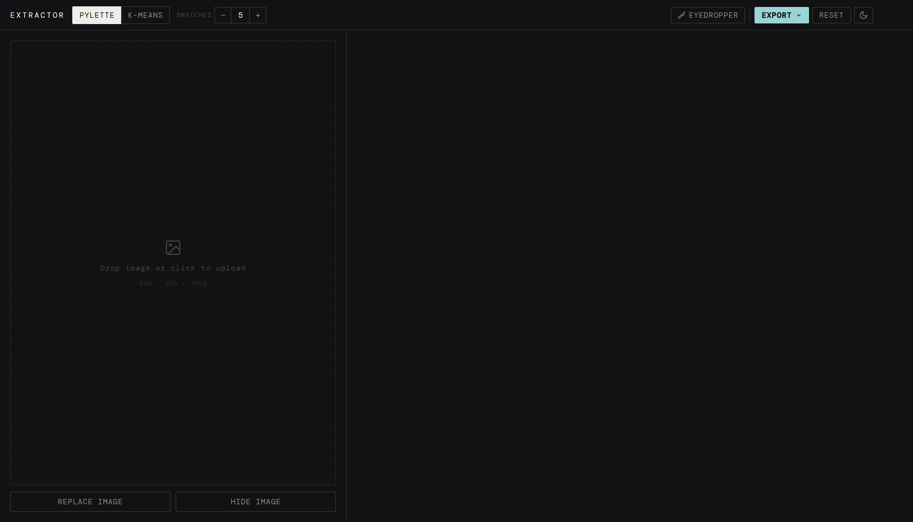
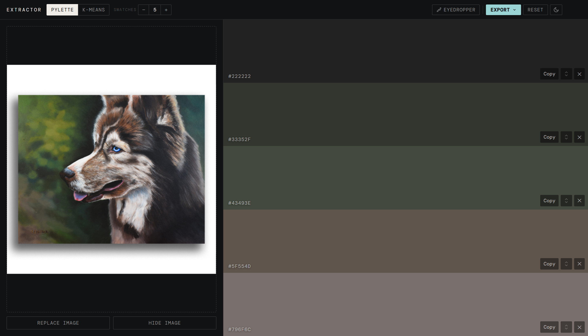
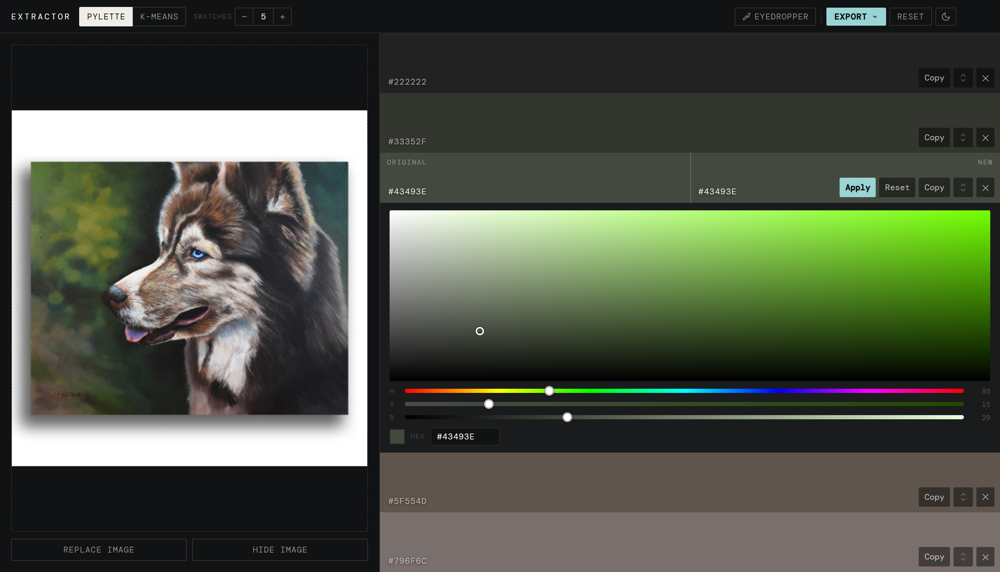
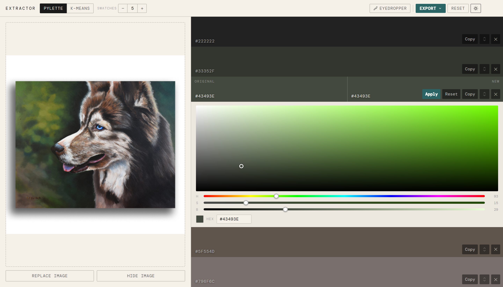

# Swatchy

A browser-based color palette extraction tool for artists.




---

## Why

As a multidisciplinary creative, I often need to extract color palettes from reference images. Swatchy speeds that up by pulling dominant colors from any image, allowing you to change them to taste or immediately import directly in Photoshop, Illustrator, or Procreate via ASE export.

---

## Features

- **Dual extraction algorithms** — it's possible to choose between results from [Pylette](https://github.com/qTipTip/Pylette) and a custom KMeans implementation side by side.
- **Color editor** — adjust hue, saturation, and brightness with a full HSB picker; compare original vs edited color on the swatch
- **ASE export** — import your palette directly into Photoshop, Illustrator, or Procreate
- **PSD export** — generates a 1920×1080 Photoshop document with color swatches ready to use
- **Copy utilities** — copy all hex codes or generate CSS custom properties in one click
- **Eyedropper** — use the browser EyeDropper API to sample any color from your screen
- **Drag to reorder** — rearrange swatches in the order that suits you
- **Light / dark mode** — works against both backgrounds so you can judge your palette accurately
- **Responsive** — works on desktop, tablet, and mobile



---

## Tech Stack

**Backend**
- [Flask](https://flask.palletsprojects.com/) — API server
- [Pylette](https://github.com/qTipTip/Pylette) — color extraction
- [scikit-learn](https://scikit-learn.org/) — KMeans clustering for the custom extraction algorithm
- [Pillow](https://python-pillow.org/) — image processing
- [psd-tools](https://github.com/psd-tools/psd-tools) — PSD file generation
- Custom binary writer for ASE (Adobe Swatch Exchange) format

**Frontend**
- Vanilla JavaScript — no framework
- HTML5 Canvas — image rendering and HSB color picker
- CSS custom properties — theming and responsive scaling

---

## How It Works

1. Upload an image — Flask receives it and runs both extraction algorithms, always pulling 10 colors, but displaying the amount you choose.
2. The frontend displays however many swatches you've selected (1–10), switching between Pylette and KMeans results via the method toggle
3. Click a swatch to open the HSB color editor and change the color to suit your needs
4. Export as ASE, PSD, or copy hex/CSS variables

The backend only handles extraction and file generation. All color editing, palette state, and UI interactions happen entirely in the browser with no page refreshes.


---

## Running Locally

**Requirements:** Python 3.10+

```bash
git clone https://github.com/LaughingStorm/Swatchy.git
cd Swatchy
python -m venv .venv
source .venv/bin/activate  # Windows: .venv\Scripts\activate
pip install -r requirements.txt
flask run
```

Then open `http://localhost:5000` in your browser.


## Project Structure

```
swatchy/
├── app.py              # Flask routes — extraction, ASE and PSD generation
├── extractor.py        # Custom KMeans extraction algorithm
├── swatchy.py          # Hex/RGB color conversion utilities
├── psd_writer.py       # PSD file generation via psd-tools
├── ase_writer.py       # ASE binary file writer (custom implementation)
├── requirements.txt
└── static/
    ├── index.html
    ├── css/
    │   └── style.css
    └── js/
        └── script.js
```

---

## ASE Format

The ASE (Adobe Swatch Exchange) writer is implemented from scratch without any third-party library, following the [binary spec](https://www.cyotek.com/blog/reading-adobe-swatch-exchange-ase-files-using-csharp).

---

## Acknowledgements

- [Pylette](https://github.com/qTipTip/Pylette) by qTipTip
- ASE format spec documented by [Cyotek](https://www.cyotek.com/blog/reading-adobe-swatch-exchange-ase-files-using-csharp)

---

## License

MIT